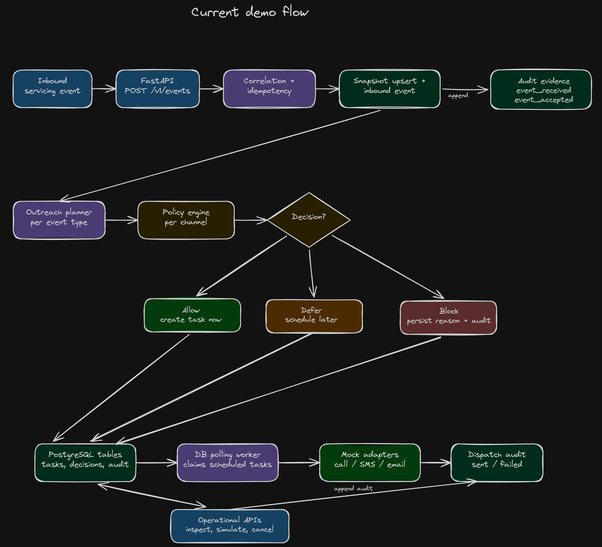
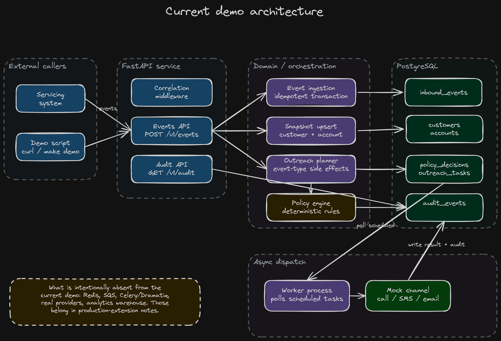

# Compliant Outreach Orchestrator

A FastAPI backend demo for regulated-servicing outreach workflows: ingest customer/account events, evaluate deterministic compliance policy, schedule or block outbound work, dispatch through mock call/SMS/email adapters, and preserve audit evidence for every important step.

The point is the backend engineering that matters before contacting real customers: idempotency, consent, opt-out handling, quiet hours, retry-safe task state, and an audit trail that explains what happened.

## Why this exists

Regulated servicing teams need outreach systems that can answer three practical questions:

- May we contact this customer on this channel right now?
- If an event is retried, can we prove we did not double-contact the customer?
- If someone asks why outreach happened or stopped, can we show durable evidence?

This demo treats those concerns as product behavior, not after-the-fact log messages.

## 5 Minutes demo

<a href="https://www.youtube.com/watch?v=GvKTY6Y4XC8">
  
</a>

## Current demo flow



Editable source: [current-target-system-flow-2026-05-30.excalidraw](docs/diagrams/current-target-system-flow-2026-05-30.excalidraw)

## What this demonstrates

- Idempotent event ingestion from external servicing systems.
- Deterministic policy checks for consent, opt-out, quiet hours, account status, and contact frequency.
- Persisted allow/block/defer decisions with explicit reasons.
- Scheduled outreach tasks for call, SMS, and email channels.
- Event-driven cancellation for opt-out, hardship, payment, and account-pause scenarios.
- PostgreSQL-backed worker dispatch through mock provider adapters.

## Local demo

Prerequisites:

- Python 3.13+
- uv
- Docker and Docker Compose

Install dependencies and create local configuration:

```bash
make install
cp .env.example .env
```

Start the local stack and apply migrations:

```bash
make docker-up
make migrate
```

Run the guided demo scenarios:

```bash
make demo
```

The demo command resets the local demo database, posts events through `POST /v1/events`, and prints task/audit summaries for three reviewer scenarios:

1. Delinquent account schedules compliant outreach.
2. Opt-out creates durable state and blocks later outreach.
3. Payment received cancels scheduled outreach.

For the full walkthrough commands, see [docs/demo-script.md](docs/demo-script.md).

## API surface

- `GET /healthz` — health check.
- `POST /v1/events` — ingest customer/account servicing events.
- `GET /v1/tasks` — list scheduled, sent, failed, cancelled, or dispatching outreach tasks.
- `GET /v1/tasks/{task_id}` — inspect task detail and policy context.
- `POST /v1/tasks/{task_id}/delivery-result` — simulate a provider delivery result.
- `POST /v1/accounts/{account_external_id}/cancel-outreach` — cancel scheduled outreach for an account.
- `GET /v1/audit` — inspect audit evidence, including correlation-ID filtered trails.

## How it works



Editable source: [current-system-design-2026-05-30.excalidraw](docs/diagrams/current-system-design-2026-05-30.excalidraw)

The local runtime intentionally stays small:

- `api`: FastAPI service on port 8000.
- `worker`: PostgreSQL-backed polling worker for due outreach tasks.
- `postgres`: transactional state for customers, accounts, inbound events, policy decisions, outreach tasks, and audit events.

## Engineering decisions

### Deterministic policy over LLM decisioning

Compliance-sensitive allow/block/defer decisions are pure, testable, and persisted with explicit reasons. Optional AI would belong later in non-authoritative drafting, summaries, or reviewer assistance after deterministic policy has allowed outreach.

### Idempotent ingestion

The event API derives idempotency from stable source event identity. Duplicate `source` + `external_id` submissions return the original accepted result without mutating snapshots or creating duplicate tasks/audit rows.

### Audit as product state

Important actions append audit events: event receipt, acceptance, policy decisions, scheduling, blocking, deferral, cancellation, dispatch success, and dispatch failure. The audit trail is queryable by correlation ID.

### PostgreSQL-backed worker for the demo

The demo uses database polling rather than Redis, SQS, Celery, or Dramatiq. That keeps the reviewer path easy to run locally and makes the important state transitions visible in one database. A broker becomes worthwhile when real provider throughput, retry isolation, and operational scaling justify the extra moving part.

### Mock providers by design

Mock call/SMS/email adapters keep the focus on orchestration correctness. Real provider setup would be useful later, but it should not obscure the compliance and idempotency story.

## Local development commands

Install dependencies:

```bash
make install
```

Run tests:

```bash
make test
```

Run lint and tests:

```bash
make check
```

Apply database migrations:

```bash
make migrate
```

Create a new Alembic migration after model changes:

```bash
make revision m="describe change"
```

Run the API locally without Docker:

```bash
make run
```

Check health:

```bash
make health
```

Expected response:

```json
{"service":"compliant-outreach-orchestrator","status":"ok"}
```

## Docker Compose

Start the local stack:

```bash
make docker-up
```

Show service status:

```bash
make docker-ps
```

Follow logs:

```bash
make docker-logs
```

Stop the stack:

```bash
make docker-down
```

Remove the local database volume as well:

```bash
make docker-clean
```

## Quality checks

Standard local verification:

```bash
make check
uv run ruff format --check .
git diff --check
```

Additional security-oriented checks available in the development environment:

```bash
uv run bandit -r src
uv run pip-audit
```

## Documentation

- [Architecture notes](docs/architecture.md)
- [Compliance assumptions](docs/compliance-assumptions.md)
- [Demo walkthrough](docs/demo-script.md)
- [Phase 1 — Database foundation](docs/phase-1-database-foundation.md)
- [Phase 2 — Audit foundation](docs/phase-2-audit-foundation.md)
- [Phase 3 — Policy engine](docs/phase-3-policy-engine.md)
- [Phase 4 — Outreach planner](docs/phase-4-outreach-planner.md)
- [Phase 5 — Full event ingestion](docs/phase-5-event-ingestion.md)
- [Phase 6 — Worker dispatch](docs/phase-6-worker-dispatch.md)
- [Phase 7 — Operational APIs](docs/phase-7-operational-apis.md)
- [Phase 8 — Demo data and walkthrough script](docs/phase-8-demo-data-and-script.md)
- [Phase 9 — Portfolio README polish](docs/phase-9-portfolio-polish.md)

## Production gaps and next extensions

- Broker-backed dispatch using SQS, Celery, Dramatiq, or Redis once throughput and retry isolation justify it.
- Real provider adapters for SMS, email, and voice behind the existing channel boundary.
- Provider callback ingestion for delivery receipts, bounces, and carrier/provider failures.
- Authentication and authorization around operational APIs.
- Observability for policy blocks, dispatch latency, retry counts, worker lag, and cancellation volume.
- Analytics export to a warehouse or ClickHouse-style store for compliance reporting dashboards.
- Stale-dispatch recovery and provider-level idempotency tokens for real outbound communication.

Production-oriented design explorations live under [docs/diagrams](docs/diagrams):

- [outreach-compliance-orchestrator-2026-05-28.png](docs/diagrams/outreach-compliance-orchestrator-2026-05-28.png)
- [event-driven-call-processing-2026-05-28.png](docs/diagrams/event-driven-call-processing-2026-05-28.png)

## What this demo intentionally does not claim

This repository is a portfolio/demo system, not a production compliance product.

It does not claim:

- actual TCPA compliance
- SOC 2, PCI, CFPB, or legal compliance certification
- real telephony, SMS, or email delivery
- production authentication or authorization
- legal advice or policy completeness

The accurate claim is narrower and stronger: this is a production-shaped backend demo showing TCPA-inspired controls, audit-ready workflow patterns, and a deterministic policy-evaluation foundation for compliant outreach orchestration.
