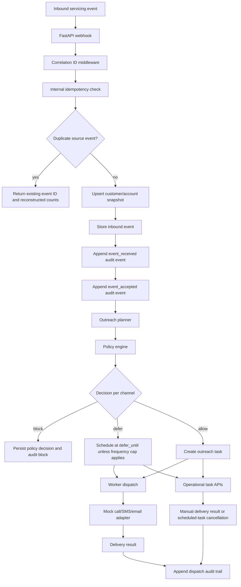
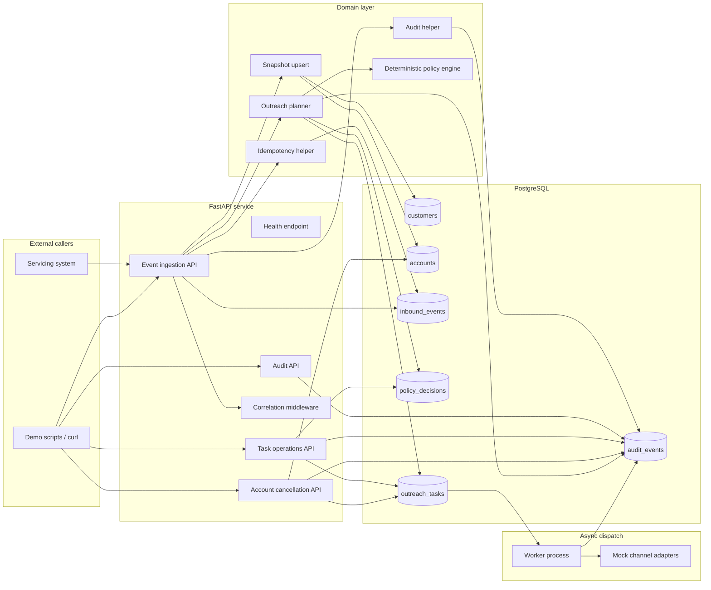
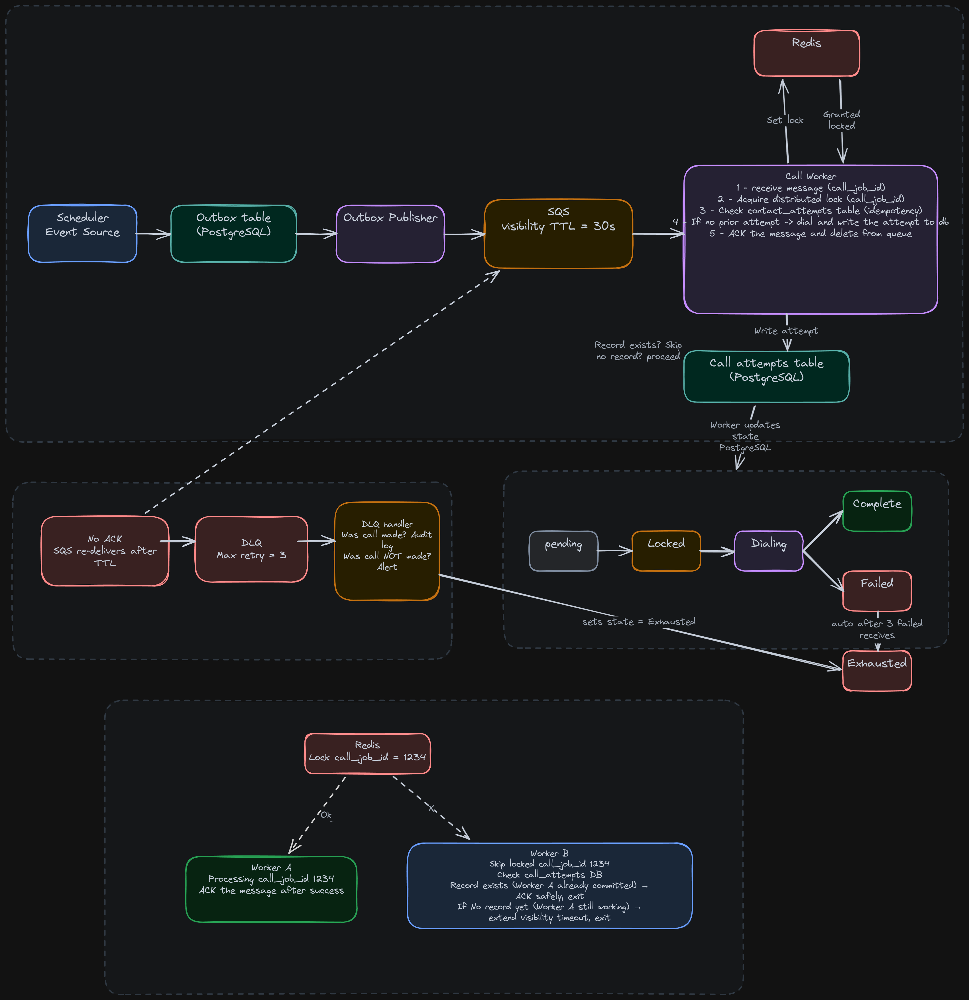

# Compliant Outreach Orchestrator

A FastAPI demo service for regulated-servicing outreach workflows.

The project accepts inbound customer/account events, preserves an auditable event trail, and includes a pure deterministic policy engine integrated with an outreach planner and worker that schedules, cancels, and dispatches outbound call/SMS/email work through mock adapters.

The emphasis is not on a flashy chatbot. The emphasis is on the backend engineering concerns that matter when contacting real customers: idempotency, consent, opt-out handling, quiet hours, retry-safe workflows, and evidence that explains what the system did.

## Product narrative

This project is being built around engineering concerns common to regulated servicing platforms:

- deterministic compliance checks before outreach
- explicit audit trail for inbound event handling, policy decisions, scheduled tasks, blocked outreach, deferrals, and cancellations
- application-level idempotent processing to avoid duplicate customer contact on sequential retries
- PostgreSQL-backed operational state
- full customer/account snapshot ingestion before planning
- planner-integrated deterministic policy checks before outbound work is scheduled
- DB-backed worker dispatch for due outbound work
- mock provider adapters to isolate orchestration from vendor APIs
- small, testable domain components rather than opaque automation

The core design principle is that compliance decisions must be reproducible. AI may eventually help draft messages or summarize audit trails, but the allow/block/defer decision itself remains deterministic and unit tested.

## Current implementation status

Implemented:

- Phase 1: database foundation
  - SQLAlchemy async models
  - Alembic migration setup
  - core tables for customers, accounts, inbound events, policy decisions, outreach tasks, and audit events
  - database constraints for idempotency-sensitive records

- Phase 2: audit foundation
  - FastAPI app structure
  - request correlation ID middleware
  - minimal inbound event ingestion
  - append-only audit helper
  - audit query endpoint
  - safe duplicate event handling

- Phase 3: deterministic policy engine
  - pure `PolicyInput` -> `PolicyResult` evaluation
  - opt-out, consent, quiet-hours, account-status, and frequency-cap rules
  - explicit allow/block/defer reasons
  - unit tests for individual rules and combined decisions

- Phase 4: outreach planner
  - event-to-outreach planning for supported servicing events
  - persisted policy decisions and scheduled outreach tasks
  - deferred scheduling for quiet-hours decisions
  - cancellation handling for payment, opt-out, hardship, and account pause events
  - application-level planner idempotency for repeat inbound-event processing

- Phase 5: full event ingestion
  - nested inbound event API with customer/account snapshots
  - customer and account upsert before planning
  - strict event type, source identity, account status, and timezone validation
  - duplicate `source` + `external_id` handling without snapshot mutation or duplicate audit/planner side effects
  - one transaction for event storage, audit, planner execution, and processed status update

- Phase 6: worker dispatch
  - DB-backed worker poller for due scheduled outreach tasks
  - conditional scheduled-to-dispatching claim before provider calls
  - mock SMS, email, and call adapters with deterministic provider message IDs
  - retry and terminal failure handling with dispatch audit events

- Phase 7: operational APIs
  - task listing and detail endpoints with customer/account context
  - policy decision context on task detail responses
  - manual delivery-result simulation for sent/failed outcomes
  - account-level scheduled outreach cancellation with audit evidence

Planned next:

- Phase 8: demo data and walkthrough script
- Phase 9: portfolio polish and production-extension notes

## Target system flow

The webhook, customer/account snapshot upsert, idempotent event storage, audit logging, policy engine, outreach planner, mock-adapter worker dispatch, and operational inspection/cancellation APIs are implemented.



## System design



## Development principles

- Keep policy decisions deterministic and testable.
- Treat audit logs as product features, not debug leftovers.
- Keep application-level idempotency internal and derived from stable source event identity; worker dispatch uses a conditional database claim before provider calls.
- Keep operational APIs as thin state-inspection and manual-demo controls; retry scheduling stays with the worker.
- Treat the Phase 6 worker as a demo dispatch boundary: stale `dispatching` recovery and real-provider idempotency tokens are intentionally deferred until provider integrations exist.

## Design documentation

- [Phase 1 — Database foundation](docs/phase-1-database-foundation.md)
- [Phase 2 — Audit foundation](docs/phase-2-audit-foundation.md)
- [Phase 3 — Policy engine](docs/phase-3-policy-engine.md)
- [Phase 4 — Outreach planner](docs/phase-4-outreach-planner.md)
- [Phase 5 — Full event ingestion](docs/phase-5-event-ingestion.md)
- [Phase 6 — Worker dispatch](docs/phase-6-worker-dispatch.md)
- [Phase 7 — Operational APIs](docs/phase-7-operational-apis.md)

## Diagrams

Additional visual asset:

Event-driven call processing



## Requirements

- Python 3.13
- uv
- Docker and Docker Compose

## Local development

Install dependencies:

```bash
uv sync
```

Create a local environment file when needed:

```bash
cp .env.example .env
```

Application configuration is centralized in `src/orchestrator/settings.py` and loaded from environment variables or `.env`. `DATABASE_URL` is used by the app. `ALEMBIC_DATABASE_URL` is optional and only needed when migrations should connect somewhere different from the app runtime URL.

Run tests:

```bash
make test
```

Run lint and tests:

```bash
make check
```

Apply database migrations:

```bash
make migrate
```

Create a new Alembic migration after model changes:

```bash
make revision m="describe change"
```

Run the API locally without Docker. Configuration is loaded from environment variables or `.env` through `src/orchestrator/settings.py`:

```bash
make run
```

Check health:

```bash
curl http://localhost:8000/healthz
```

Expected response:

```json
{"service":"compliant-outreach-orchestrator","status":"ok"}
```

## Docker Compose

Start the local stack:

```bash
make docker-up
```

Services:

- `api`: FastAPI service on port 8000
- `worker`: DB-backed outreach dispatch worker using mock channel adapters
- `postgres`: PostgreSQL database on port 5432
- `redis`: reserved infrastructure for later queue/provider integration phases on port 6379

Stop the stack:

```bash
make docker-down
```

Remove database volume as well:

```bash
make docker-clean
```

## What this demo intentionally does not claim

This project is a portfolio/demo system, not a production compliance product.

It does not claim:

- actual TCPA compliance
- SOC 2, PCI, or CFPB compliance
- real telephony, SMS, or email provider integration
- legal advice or policy completeness

The accurate claim is narrower and stronger: this is a production-shaped backend demo showing TCPA-inspired controls, audit-ready design patterns, and a deterministic policy-evaluation foundation for future outreach orchestration.
