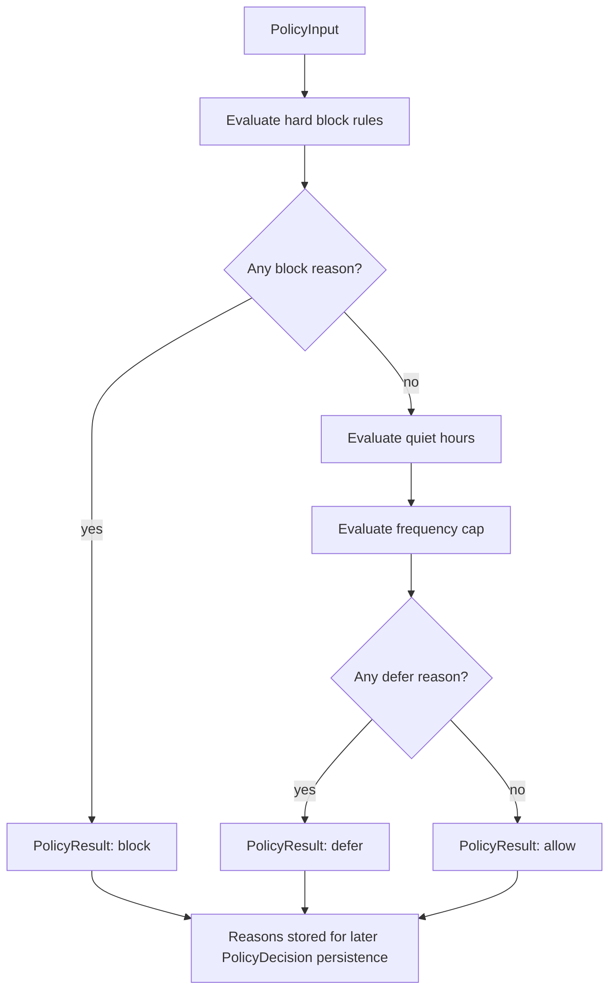
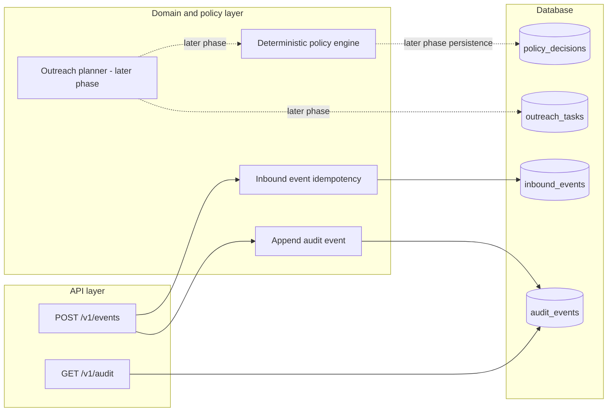

# Phase 3 — Policy engine

## Purpose

Phase 3 adds the deterministic decision layer for compliant outreach.

The service is moving toward a workflow where inbound account events become scheduled outreach tasks. Before any task can be scheduled, the system needs to answer a controlled question: is this channel allowed for this customer, this account state, and this scheduled time?

This phase keeps that answer intentionally deterministic. The policy engine does not call an LLM, does not query the database, and does not depend on hidden runtime state. It accepts a compact input object and returns an explicit decision with reasons.

That is deliberate. Compliance-oriented systems need reproducible evidence more than creative improvisation. A model-generated "probably safe" is not an audit strategy.

## What this phase builds

This phase introduces:

- `src/orchestrator/policy/`
- `PolicyInput`
- `PolicyResult`
- `evaluate_policy`
- unit tests for each policy rule
- regression coverage for block/defer precedence

The policy engine currently evaluates five rule groups:

1. Opt-out suppression
   - Blocks all outreach when the customer has opted out.

2. Channel consent
   - SMS requires SMS consent.
   - Calls require call consent.
   - Email requires email consent.

3. Account status
   - Paused accounts block outreach.
   - Resolved accounts block outreach.

4. Quiet hours
   - Calls and SMS are only allowed from 09:00 inclusive to 20:00 exclusive in the customer's local timezone.
   - Calls and SMS outside that window are deferred to the next valid 09:00 local time.
   - Email is not quiet-hours restricted in this phase.

5. Contact frequency cap
   - If the caller reports that the customer has already reached the configured rolling attempt cap, the result is deferred.
   - The policy engine receives the recent attempt count as input. It does not calculate it from the database in this phase.

## Policy input and output

`PolicyInput` is pure data:

- `channel`
- `scheduled_at`
- `customer_timezone`
- `sms_consent`
- `call_consent`
- `email_consent`
- `opted_out`
- `account_status`
- `recent_outbound_attempt_count`
- `frequency_cap`

`PolicyResult` contains the decision evidence:

- `decision`: `allow`, `block`, or `defer`
- `channel`
- `reasons`
- `defer_until`, when a defer rule can propose a better time

This keeps the engine easy to test and easy to explain in a review. The caller supplies facts. The engine returns a decision. Nothing is hidden.

## Decision flow

## System design context

Phase 3 is intentionally a domain component, not an API endpoint.

In the current phase, the planner integration is not built yet. Phase 4 will call `evaluate_policy` for each proposed outreach task and persist the resulting `PolicyDecision` rows.

## Why no LLM policy decisioning

The policy engine does not use OpenRouter or any other LLM provider.

Reasoning:

- Compliance rules need deterministic, repeatable outcomes.
- Unit tests should prove exact behavior for consent, opt-out, quiet hours, account status, and frequency limits.
- Audit records should contain concrete reasons, not model interpretations.
- The demo is stronger when it shows disciplined orchestration and evidence rather than unnecessary AI theater.

A future LLM integration could still be useful outside of authoritative policy decisions, for example:

- drafting candidate email/SMS copy after deterministic policy approval
- summarizing an audit trail for an internal reviewer
- classifying messy inbound free text into structured event types

Those are different responsibilities. The decision to contact a customer remains deterministic.

## Rule precedence

The engine uses this precedence:

1. block
2. defer
3. allow

Hard blocks return immediately before defer-only validation.

That matters for cases like an opted-out customer with malformed timezone data. The correct result is still `block` because opt-out is absolute. The engine should not fail while trying to evaluate quiet hours for an outreach attempt that is already forbidden.

Examples:

- opted out + missing SMS consent + paused account
  - decision: `block`
  - reasons: `customer_opted_out`, `missing_sms_consent`, `account_paused`

- SMS scheduled at 08:30 local time
  - decision: `defer`
  - reasons: `quiet_hours`
  - defer_until: same day at 09:00 local time

- SMS scheduled at 20:00 local time
  - decision: `defer`
  - reasons: `quiet_hours`
  - defer_until: next day at 09:00 local time

- Email scheduled at 23:00 local time with email consent
  - decision: `allow`
  - reasons: `policy_allowed`

## Design decisions

### Keep the policy engine pure

The engine does not query SQLAlchemy models or open a database session.

Reasoning:

- It is easier to test.
- It is easier to reuse from the future planner and worker paths.
- It keeps data fetching separate from decision logic.
- It avoids hiding policy behavior behind database fixtures.

Later phases can calculate the rolling 24-hour contact count from `outreach_tasks` and pass the count into `PolicyInput`.

### Return explicit reasons

Every result contains machine-readable reason strings.

Reasoning:

- Reviewers can see exactly why a decision was made.
- The reasons can be stored in `policy_decisions.reasons`.
- Future APIs can expose the reasons without parsing logs.
- Tests can verify exact policy behavior.

### Defer instead of block for timing rules

Quiet-hours and frequency-cap violations produce `defer` rather than `block`.

Reasoning:

- The customer may still be eligible for contact later.
- The planner can reschedule instead of discarding the attempt.
- This makes `allow`, `block`, and `defer` all meaningful outcomes.

### Block for consent, opt-out, and terminal account states

Opt-out, missing channel consent, paused accounts, and resolved accounts produce `block`.

Reasoning:

- These are hard eligibility failures for automated outreach.
- Rescheduling does not make missing consent safe.
- The result should be easy for operators and reviewers to interpret.

## Tests

The unit test suite covers:

- opted-out customers block every channel
- each channel requires its matching consent flag
- paused and resolved accounts block outreach
- calls and SMS defer before 09:00 local time
- calls and SMS defer at or after 20:00 local time
- email ignores quiet-hours restrictions
- allowed decisions inside the valid contact window
- frequency cap defers outreach
- combined block decisions preserve multiple reasons
- block precedence over defer
- block precedence skips defer validation
- invalid timezones raise a clear `ValueError` when defer rules need timezone evaluation

## Current limitations

This phase does not yet:

- persist policy decisions
- calculate rolling 24-hour contact counts from the database
- generate outreach tasks
- cancel pending outreach for payment or opt-out events
- expose policy decisions through an API

Those belong to later phases. Keeping this phase small makes the core policy behavior easier to prove.

## Narrative

Phase 3 makes the project more than an event receiver. It now has the decision point that prevents unsafe outreach before scheduling begins.

The important design choice is restraint: policy decisions are deterministic, evidence-bearing, and unit tested. That is the right shape for regulated servicing software. If the system later adds AI, it should assist with non-authoritative tasks like drafting copy or summarizing evidence, not deciding whether a customer may be contacted.
